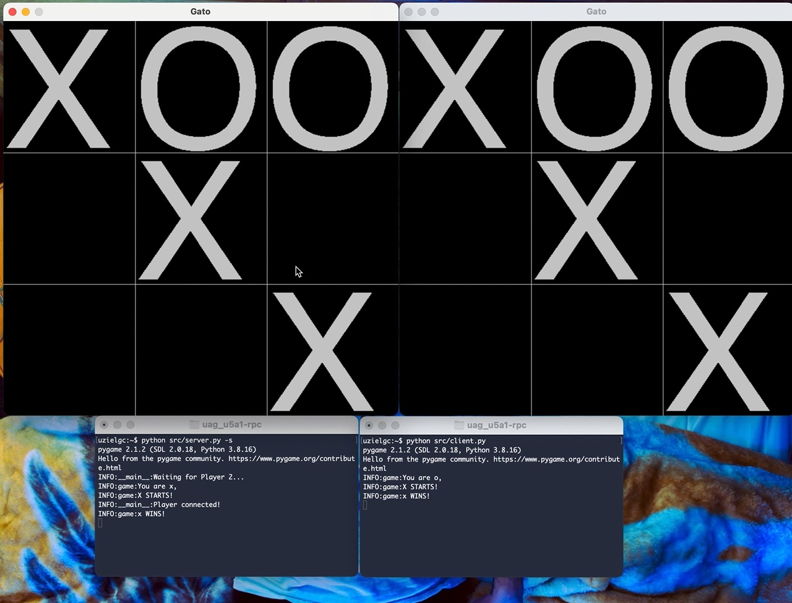
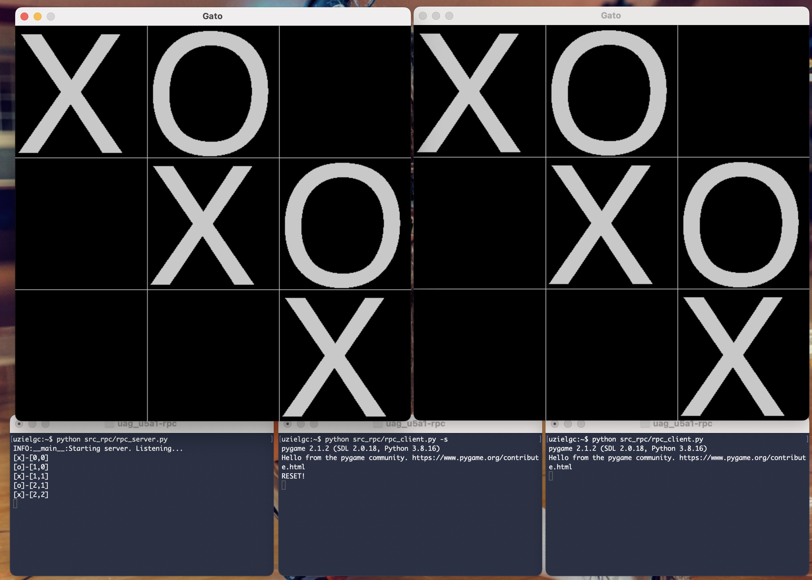

## U5 A1: RPC

### Author: Eloy Uziel García Cisneros (eloy.garcia@edu.uag.mx)
#### Repo: https://github.com/uzielgc/uag_u5a1-rpc

## Documentación

El código fuente se encuentra dentro de la carpeta [src](src), este código reutiliza el código de las practicas pasadas,
adicionalmente se incluye una solución alternativa que utiliza gRPC.

La versión en gRPC ejecuta un servidor al cual se conectarán los dos clientes, cada uno ejecuta una versión propia del juego.
Se incluye proto file and auto-generated python code.

Stub generated with `grpc_tools` module

```
python -m grpc_tools.protoc --proto_path=. ./gato.proto --python_out=. --grpc_python_out=.
```

Para ambas versiónes la lógica del juego se encuentra en `game.py`

La evidencia en imagenes y/o video se encuentra en la carpeta [media](media).
El código esta comentado en los puntos clave del proceso.

*NOTA: instalar los requerimientos previo a ejecución:

```
pip install -r requirements.txt
```

[](media/gato.mov "Video Demo")

* Click en la imagen para ir al video demo. (media/gato.mov)^


RPC-version:

[](media/gato-rpc.mov "Video Demo")

* Click en la imagen para ir al video demo. (media/gato-rpc.mov)^

### Validación/Uso

Server:
    `python src/server.py -s`

Cliente:
    `python src/client.py`


El jugador con el primer turno (X) es el host del juego (servidor).

Para reinicar presione espacio. El turno pasará al siguiente jugador.

### Validación/Uso (versión RPC)

Correr server:
    `python src/server.py -s`

Correr cliente:
    `python src/client.py`

### Output:

Terminal 1 server:
```
uzielgc:~$ python src/server.py -s
pygame 2.1.2 (SDL 2.0.18, Python 3.8.16)
Hello from the pygame community. https://www.pygame.org/contribute.html
INFO:__main__:Waiting for Player 2...
INFO:game:You are x, 
INFO:game:X STARTS!
INFO:__main__:Player connected!
INFO:game:x WINS!
RESET!
INFO:game:Wait for move!
INFO:game:o WINS!
```

Terminal 2 client:
```
uzielgc:~$ python src/client.py 
pygame 2.1.2 (SDL 2.0.18, Python 3.8.16)
Hello from the pygame community. https://www.pygame.org/contribute.html
INFO:game:You are o, 
INFO:game:X STARTS!
INFO:game:x WINS!
INFO:game:YOUR TURN!
INFO:game:o WINS!

```
